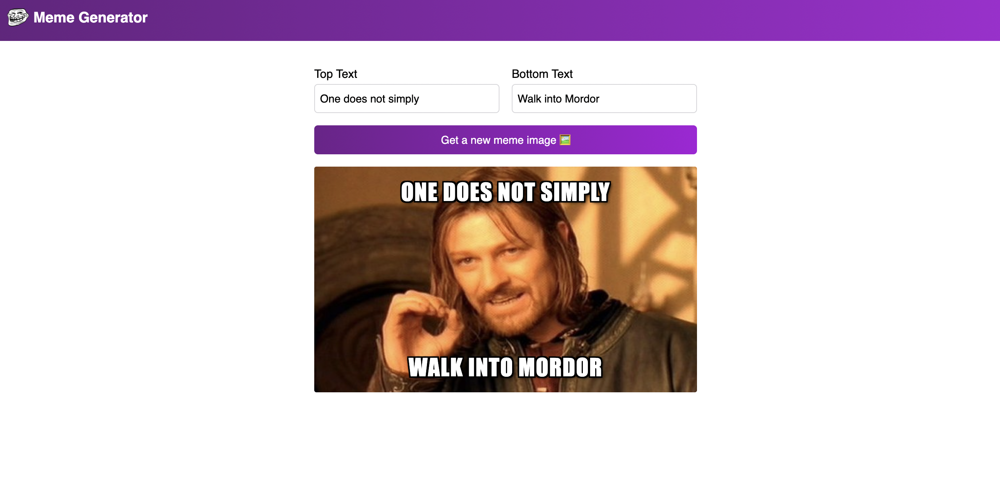

# Meme Generator

A web application that generates basic $$memes with customizable text and images.

## Live Preview

## Link to Demo

[Meme Generator](https://meme-generator-dani-camp.netlify.app/)

## What it does

The Meme Generator allows users to create and share funny memes by adding text to a random image. The application provides a simple and intuitive interface for users to input their desired text, and then generates a meme with the text overlaid on a random image.

## How it works

1. The application uses a library of pre-loaded images, which are randomly selected and displayed on the screen.
2. The user inputs their desired text, which is then overlaid on top of the image using React and CSS.
3. The application uses JavaScript to handle user input, generate the meme, and update the display in real-time.

## Technologies used

* **Front-end:** React, JavaScript, CSS
* **Back-end:** None (client-side only)
* **Libraries:**
	+ React for building the user interface and handling state changes
	+ JavaScript for generating the meme and handling user input
	+ CSS for styling the application
* **Tools:**
	+ Vite for building and serving the application
	+ ESLint for code linting and formatting

## Features

* Generate memes with customizable text
* Randomly select images from a pre-loaded library
* Real-time updates to the display
* Simple and intuitive user interface
