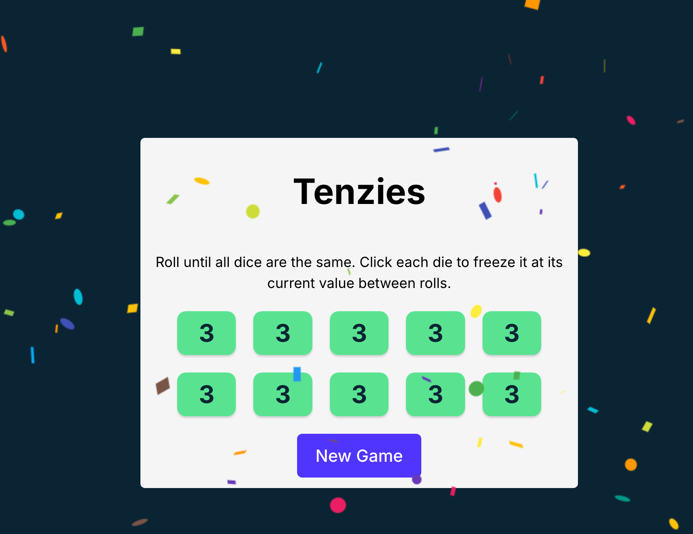

# Tenzie

A simple dice rolling game where you need to roll the same number ten times in a row.

## Preview

## Live to Demo

[Tenzie](https://tenzies-dani-camp.netlify.app/)

## How to Play

1. Click on the "Roll" button to roll the dice.
2. If any of the dice match, they will be locked in place.
3. Continue rolling until you get the same number ten times in a row.
4. If you make a mistake, you can unselect the desired dice, or if you want to start over, click on the "Roll" or "New Game" button.

## Technologies Used

* **Front-end:** React, JavaScript, CSS
* **Back-end:** None (client-side only)
* **Libraries:**
	+ React for building the user interface and handling state changes
* **Tools:**
	+ Vite for building and serving the application
	+ ESLint for code linting and formatting
